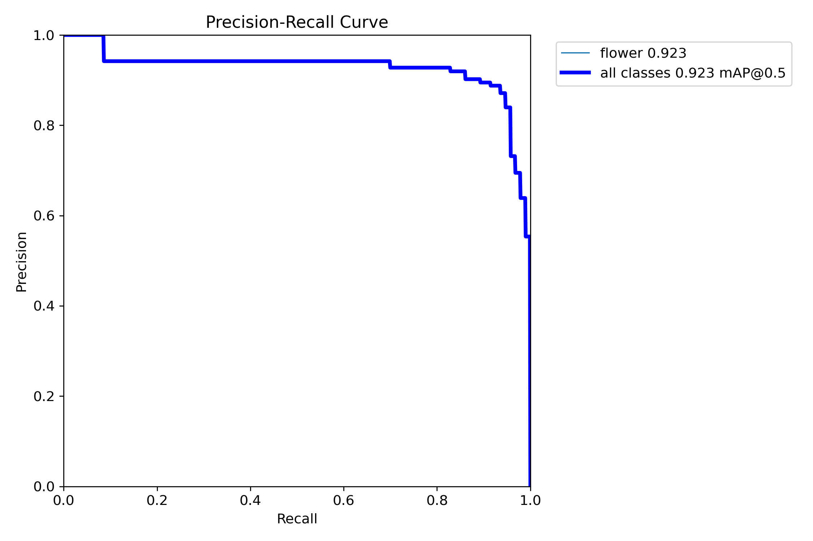
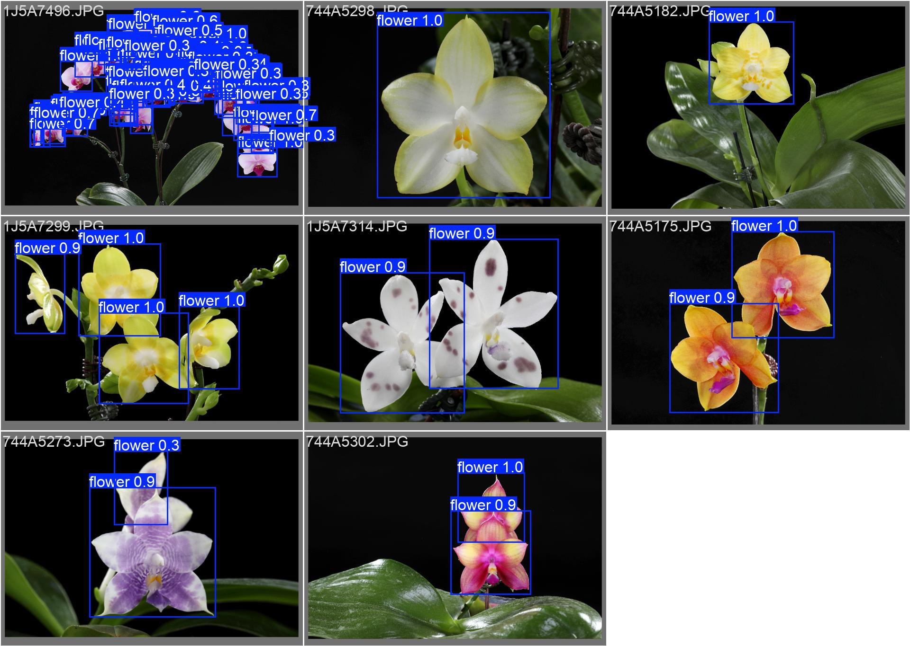
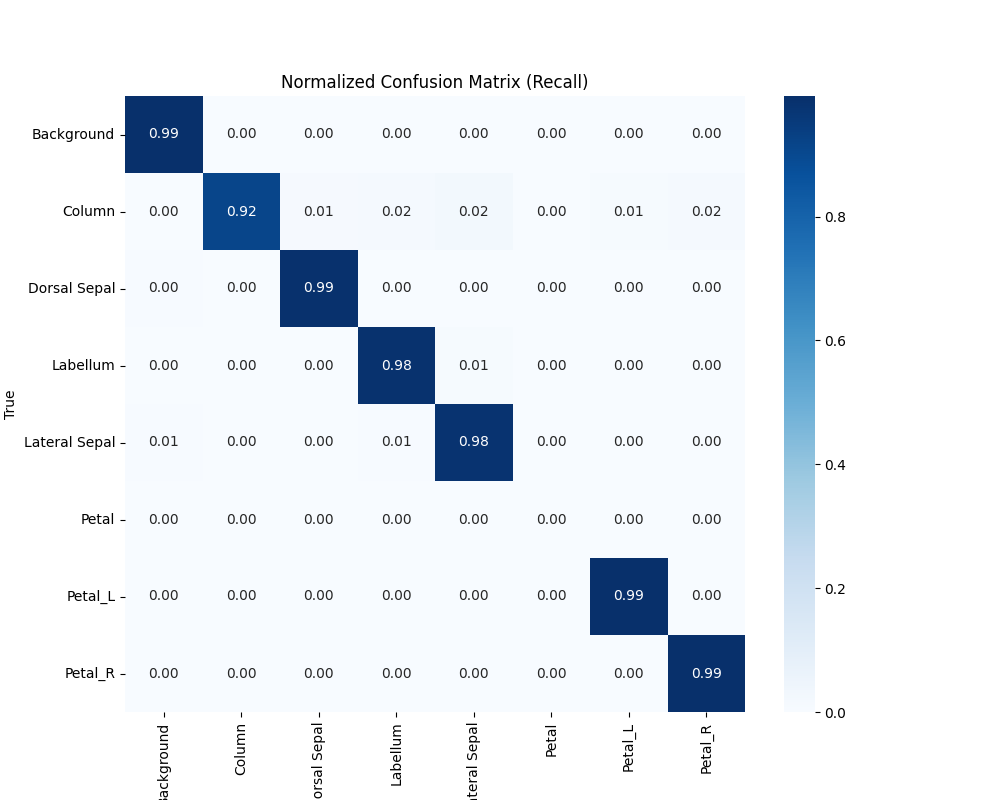
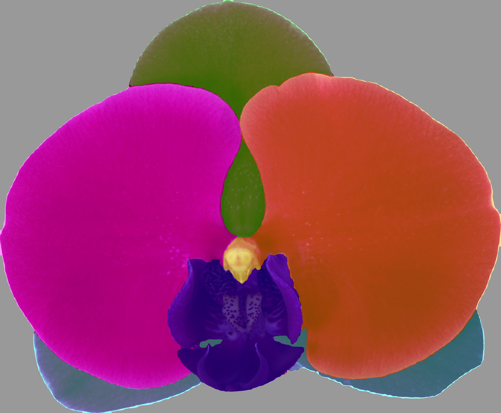
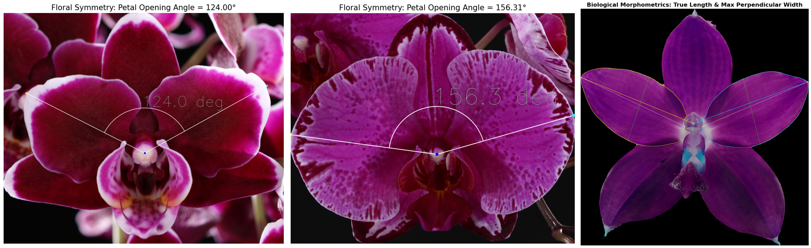
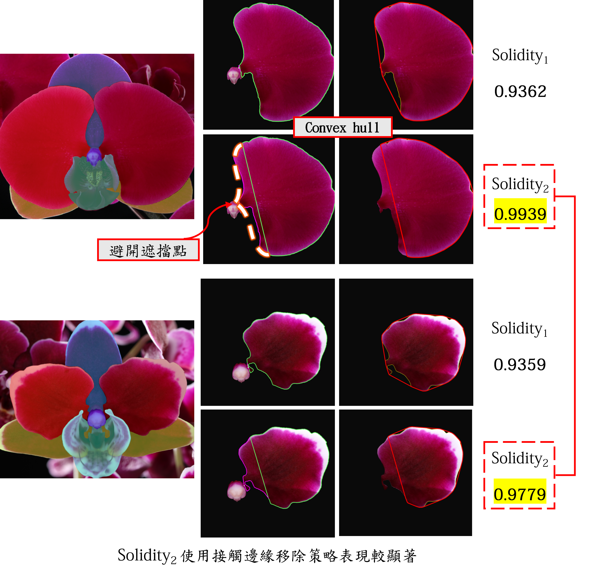

# Phal Quantifier 2026

Repository for orchid research workflows covering detection, segmentation, and quantitative analysis.

## What This Repo Contains

- [Detection](packages/Detection/README.md): YOLO-based flower detection, ONNX export, and YOLO + SAM2 instance extraction
- [Segmentation](packages/Segmentation/README.md): DINOv3-based 8-class semantic segmentation training, inference, and evaluation
- [Quantification](packages/Quantification/README.md): notebook-driven analysis for morphometrics, color analysis, and related measurements

## Repository Layout

- `packages/Detection/`: detector training and export scripts
- `packages/Segmentation/`: segmentation training, inference, and evaluation scripts
- `packages/Quantification/`: analysis notebooks
- `examples/`: saved example outputs from each workflow
- `scratch/`: temporary or experimental files

## Quick Start

Install dependencies from the repository root:

```bash
uv sync
```

Then run the package you need:

```bash
cd packages/Detection
uv run train.py
```

```bash
cd packages/Segmentation
uv run fine-tuning.py
```

```bash
cd packages/Segmentation
uv run inference.py
```

```bash
cd packages/Segmentation
uv run evaluation.py
```

## Example Outputs

### Detection

Precision-recall curve and detection visualization:





### Segmentation

Segmentation evaluation and output examples:







### Quantification

Morphometric analysis figures:






## Environment Notes

- Python 3.12+
- Use the package-level `pyproject.toml` or `requirements.txt` files when working inside a specific package.
- If you use the segmentation visualization notebook, put `HF_TOKEN` in a local `.env` file at the repository root or in the active working directory. The `.env` file is ignored by git.

## Package Documentation

- [packages/Detection/README.md](packages/Detection/README.md)
- [packages/Segmentation/README.md](packages/Segmentation/README.md)
- [packages/Quantification/README.md](packages/Quantification/README.md)

## License

No license file is currently included in this repository.