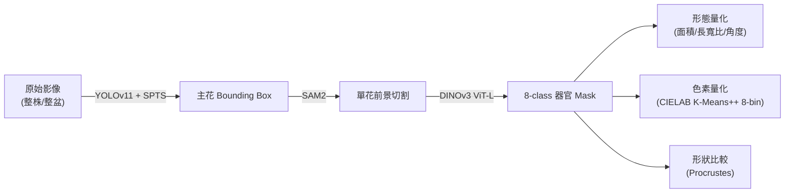

# 蝴蝶蘭花器官自動量化系統 — 研究方法與實作文件

> **用途**：提供給論文撰寫夥伴，完整理解本研究的方法論、模型架構、實驗設定與資料流。
> **專案名稱**：phal-quantifier-2026（投稿目標：2026 CIGR）

---

## 1. 研究目標

建立一條端到端 (end-to-end) 的自動化分析流程，從整株/整盆蝴蝶蘭 (Phalaenopsis) 的拍攝影像出發，自動完成：

1. **花朵偵測** — 定位每朵花的位置
2. **器官語意分割** — 將單朵花分割為 8 類器官區域
3. **形態與色彩量化** — 從分割結果萃取可比較的數值指標



---

## 2. 專案結構

```
packages/
├── Detection/           # Stage 1
│   ├── train.py         # YOLO 訓練
│   ├── yolo_sam2.py     # YOLO+SAM2 推論 pipeline
│   └── toOnnx.py        # 模型匯出
├── Segmentation/        # Stage 2
│   ├── fine-tuning.py       # 主線訓練 (8-class, single-layer)
│   ├── fine-tuning_weight.py # 實驗：multi-layer gated fusion
│   ├── inference.py         # 推論 + 視覺化
│   ├── extract_petal_mask.py # 花瓣 mask 提取
│   └── evaluation.py       # 指標計算 + confusion matrix
└── Quantification/      # Stage 3
    ├── main-quantification.ipynb  # 形態量化
    ├── ColorQuantify.ipynb        # 色素量化 (5-phase pipeline)
    ├── floweral_seperate.ipynb    # 器官分離視覺化
    ├── procruste.ipynb            # Procrustes 形狀分析
    ├── orchid_color_features.csv  # 190 samples × 8-bin ratio 輸出
    ├── Elbow_Method_Curve.png     # K 選擇依據
    └── Pigment/                   # 中間產物 & 論文用圖
        ├── balanced_lab.npy / balanced_rgb.npy  # 去偏採樣後的像素
        ├── global_centers_lab.npy               # K=8 cluster 中心 (LAB)
        ├── 00_Academic_Pipeline_Flowchart.png    # 流程圖
        ├── 01_color_space_comparison.png         # RGB vs LAB 視覺化
        ├── 02_K_Evaluation.png                   # Elbow + Silhouette
        ├── 03_global_palette.png                 # 8-color 全域色票
        ├── 04_quantified_features.csv            # 代表性樣本特徵
        └── 05_phenotype_linked_barchart.png      # 表型連結堆疊長條圖
```

---

## 3. Stage 1 — Flower Detection

### 3.1 方法概述

使用 **YOLOv11n** (Ultralytics) 偵測影像中所有花朵的 bounding box。選擇 nano 版本是因為花朵佔影像比例通常足夠，不需大模型；但為補償小物體場景，推論解析度拉高至 **960×960 px**。

### 3.2 訓練設定

| 項目 | 設定值 |
|------|--------|
| Base model | `yolo11n.pt` (pretrained on COCO) |
| Input resolution | 960 px |
| Epochs / Patience | 200 / 100 |
| Batch size | 8 |
| Optimizer | SGD, lr₀=0.003, lr_f=5e-5 |
| Augmentation | Mosaic 45% (最後 30 epoch 關閉), shear=10°, flip_ud/lr=0.1, HSV jitter |
| Dropout | 0.1 |

**資料格式**：標準 YOLO 格式，`datasets/flower.yaml` 指向 images + labels 目錄，label 為 `class cx cy w h` (normalized)。

### 3.3 YOLO + SPTS + SAM2 Instance Extraction

用途：從整株照片中自動識別並切出**唯一主花**的乾淨前景，供 Stage 2 使用。

**流程**：
1. YOLO 偵測 → 取得所有 bounding boxes
2. **Spatial Prominence-based Target Selection (SPTS)** — 從所有偵測結果中選出唯一主花：
   - 計算每個 box 的顯著性分數：$S_i = \alpha \cdot \hat{A}_i - \beta \cdot \hat{D}_i$
   - $\hat{A}_i$：box 面積 / 最大 box 面積（normalized area）
   - $\hat{D}_i$：box 中心到圖片中心的歐式距離 / 圖片對角線長度（normalized distance）
   - 預設 $\alpha=1.0, \beta=1.5$，選擇分數最高的唯一 box
   - **設計理由**：攝影師特寫時，目標花朵必然面積最大且最靠近畫面中心
3. 將選出的 box 送入 **SAM2** (`facebook/sam2-hiera-large`, `multimask_output=False`) → 產生 instance mask
4. 輸出：單花黑底 PNG

> [!NOTE]
> **SAM2 vs Stage 2 的差異**：SAM2 做的是 instance-level 前景/背景二分類；Stage 2 的 DINOv3 做的是 organ-level 8-class 語意分割。兩者目的不同。

---

## 4. Stage 2 — Organ Semantic Segmentation

### 4.1 任務定義

對裁切出的**單朵花影像**進行 pixel-level 8-class 語意分割。

### 4.2 類別定義

| Index | 英文名 | 中文名 | 標注色 (R,G,B) |
|-------|--------|--------|----------------|
| 0 | Background | 背景 | (0,0,0) |
| 1 | Column | 蕊柱 | (255,255,0) |
| 2 | Dorsal Sepal | 背萼片 | (0,255,0) |
| 3 | Labellum | 唇瓣 | (0,0,255) |
| 4 | Lateral Sepal | 側萼片 | (0,255,255) |
| 5 | Petal | 花瓣 (未分左右) | (255,0,0) |
| 6 | Petal_L | 左花瓣 | (255,0,255) |
| 7 | Petal_R | 右花瓣 | (255,165,0) |

> Class 5 與 6/7 並存。主線版本分左右花瓣 (6/7)，是為了下游量化時分析兩片花瓣的對稱性。

### 4.3 模型架構

**Backbone**：DINOv3 ViT-L (`facebook/dinov3-vitl16-pretrain-lvd1689m`)，透過 HuggingFace `transformers.AutoModel` 載入。

**Feature extraction**：取最後一層 hidden state (`extract_layers=[-1]`) 的 spatial tokens。DINOv3 的 token 序列為 `[CLS, registers..., patch_1, ..., patch_M]`，取最後 `num_patches` 個 token 即為 spatial features：

```python
feat_spatial = hidden_states[-1][:, -num_patches:, :]  # shape: (B, M, 1024)
# reshape → (B, 1024, H/16, W/16)
```

**Segmentation head**：
```
BatchNorm2d(1024) → Conv2d(1024→512, 1×1) → BN → ReLU → Conv2d(512→8, 1×1)
→ Bilinear upsample to (H, W)
```

無 decoder、無 skip connection — 完全依賴 backbone 特徵品質。

### 4.4 訓練設定

| 項目 | 設定值 |
|------|--------|
| Input resolution | 2400×2400 px |
| Patch size | 16 |
| Batch size | 2 (受 VRAM 限制) |
| Optimizer | AdamW (weight_decay=0.01) |
| LR (backbone) | 5e-6 |
| LR (head) | 4e-4 |
| Scheduler | CosineAnnealingLR (T_max=epochs) |
| Loss | CrossEntropyLoss |
| Metric (checkpoint) | Validation mIoU |
| Early stopping | patience=15, min_delta=5e-4 |
| Gradient checkpointing | Enabled |

### 4.5 資料增強

| 增強方式 | 參數 |
|----------|------|
| RandomHorizontalFlip | p=0.5 |
| RandomRotation | ±15° |
| ColorJitter | brightness/contrast/saturation=0.2, hue=0.03 |
| GaussianBlur | p=0.2, kernel=3, σ∈[0.1, 1.2] |

**刻意不使用** random crop / scale / translation — 因為蘭花器官（尤其 column）可能被裁出畫面。

**Image/Mask 同步**：使用 `torch.manual_seed(same_seed)` 確保 flip/rotation 在 image 和 mask 上一致。

### 4.6 資料格式

```
Datasets/<name>/
├── train/
│   ├── images/   *.jpg / *.png
│   └── masks/    *.png  (pixel value = class index, 0-7)
└── val/
    ├── images/
    └── masks/
```

Mask 為灰階 PNG，pixel value 直接對應 class index。

### 4.7 實驗變體：Multi-layer Gated Fusion

`fine-tuning_weight.py` 嘗試融合全部 24 層 hidden states：
- 為每層學一個 scalar weight → softmax → 加權求和
- Head 輸入維度不變 (1024)，因為是加權「疊加」而非 concatenate
- 訓練日誌記錄每層權重演變，用於分析哪些層對分割最重要

### 4.8 評估指標

`evaluation.py` 計算：
- **Global Pixel Accuracy**
- **mIoU** (mean Intersection over Union)
- **Per-class IoU / Accuracy**
- **Confusion Matrix** (normalized by recall)

### 4.9 花瓣提取

`extract_petal_mask.py` 專門提取 class 6 (Petal_L) + class 7 (Petal_R) 的像素區域，輸出四種格式：

| 輸出 | 說明 |
|------|------|
| `petal_masks/` | Binary mask (255/0) |
| `petal_class_masks/` | Class-preserving mask (0/6/7) |
| `petal_black_bg_rgb/` | 黑底花瓣 RGB |
| `petal_cutouts/` | RGBA 透明背景 |

---

## 5. Stage 3 — Quantification

### 5.1 形態量化 (`main-quantification.ipynb`)

從 segmentation mask 計算每個器官的幾何指標：

| 指標 | 計算方式 |
|------|----------|
| 面積 (Area) | mask 中特定 class 的像素總數 |
| 長寬比 (Aspect Ratio) | 最小外接矩形 width / height |
| Convex Hull 比 | contour area / convex hull area |
| 主軸角度 (Angle) | fitEllipse 或 PCA 求長軸方向 |

### 5.2 色素量化 (`ColorQuantify.ipynb`)

完整的 5-phase pipeline，從花瓣像素中萃取標準化色素分佈特徵：

**Phase 1 — Image Preprocessing**
- 輸入：花瓣 cutout 圖片（來自 `extract_petal_mask.py` 的 `petal_cutouts/`）
- 色彩空間轉換：RGB → **CIELAB**（感知均勻，更貼近人眼對花色的判斷）

**Phase 2 — Pigment Extraction（生理雙重過濾）**
- 過濾條件：$L^* > 15$ 且 $C^* > 10$（Chroma = $\sqrt{a^{*2} + b^{*2}}$）
- 目的：排除黑色背景殘留（低亮度）與灰階/白色區域（低彩度），僅保留具有色素意義的像素

**Phase 3 — Spatial Downsampling（空間去偏採樣）**
- 將 LAB 色彩空間劃分為 **3D voxel grid**
- 每個 voxel 設定 **max_per_voxel** 上限（anti-dominance limit）
- 防止大面積均勻色塊（如白色花瓣底色）主導 clustering 結果
- 輸出：`balanced_lab.npy`, `balanced_rgb.npy`

**Phase 4 — Palette Generation（全域色票建立）**
- 使用 **Elbow Method (SSE)** + **Silhouette Score** 客觀評估最佳 K 值 → **K=8**
- 對去偏採樣後的像素執行 **K-Means++ clustering** (在 LAB 空間)
- 輸出：8 個 cluster 中心 = **Global Standard Palette** (color codebook)
- 存檔：`global_centers_lab.npy`, `global_centers_rgb.npy`

**Phase 5 — Inference & Vectorization**
- 對每朵花的花瓣像素，計算與 8 個 cluster 中心的 **Euclidean distance**（LAB 空間）
- 將每個像素指派到最近的 bin → 統計各 bin 的**面積佔比**
- 輸出：`orchid_color_features.csv`（190 samples × 8 columns, `ColorBin_0~7_Ratio`，加總 ≈ 1.0）

**中間產物與視覺化**（`Pigment/` 目錄）：

| 檔案 | 說明 |
|------|------|
| `00_Academic_Pipeline_Flowchart.png` | 完整 pipeline 流程圖 |
| `01_color_space_comparison.png` | RGB vs CIELAB 色彩空間比較 |
| `01.5_Before_After_Comparison.png` | 去偏採樣前後的散佈圖對比 |
| `02_K_Evaluation.png` | Elbow + Silhouette 雙指標圖 |
| `03_global_palette.png` | 8-color 全域色票視覺化 |
| `04_quantified_features.csv` | 代表性樣本的量化結果 |
| `05_phenotype_linked_barchart.png` | 堆疊長條圖 — 色素分佈 × 表型 |

### 5.3 形狀比較 (`procruste.ipynb`)

Procrustes 分析：以 contour 或 landmark 做形狀對齊，量化不同品種/個體間的形態差異。

### 5.4 器官分離視覺化 (`floweral_seperate.ipynb`)

將 mask 的每個 class 分別展示為獨立圖層，用於品質檢查與圖片製作。

---

## 6. 復現步驟摘要

```bash
# 1. 環境
cd 2026-CIGR-phal-yolo-seg-quantify
uv sync                    # Python 3.12+, 需 .env 中放 HF_TOKEN

# 2. Detection 訓練
cd packages/Detection
uv run train.py            # → flower_detect/FD/weights/best.pt

# 3. (Optional) YOLO + SAM2 切花
uv run yolo_sam2.py        # → datasets/test/_segments/

# 4. Segmentation 訓練
cd ../Segmentation
uv run fine-tuning.py      # → training_result/<run>/best_finetune_LandR.pth

# 5. Segmentation 推論
uv run inference.py        # → Inference/<run>/res_*.png

# 6. 花瓣 mask 提取
uv run extract_petal_mask.py  # → Inference/petal_only_outputs/

# 7. 評估
uv run evaluation.py       # → Evaluation/<run>/confusion_matrix.png + summary.json

# 8. 量化分析
cd ../Quantification       # 開啟 notebooks 依序執行
```

---

## 7. 撰寫論文時的注意事項

### 7.1 Methods 區段對應

| 論文章節 | 對應程式碼 | 要寫的重點 |
|----------|-----------|-----------|
| 2.1 Flower Detection | `Detection/train.py` | YOLO 版本、input resolution、augmentation policy |
| 2.2 Primary Flower Identification | `Detection/yolo_sam2.py` | SPTS 演算法公式、α/β 參數選擇依據 |
| 2.3 Instance Extraction | `Detection/yolo_sam2.py` | SAM2 作為 box-prompted segmenter |
| 2.4 Organ Segmentation | `Segmentation/fine-tuning.py` | DINOv3 backbone + lightweight head、differential LR、img_size=2400 的理由 |
| 2.5 Morphometric Analysis | `Quantification/main-quantification.ipynb` | 面積、長寬比、角度等幾何指標 |
| 2.6 Pigment Quantification | `Quantification/ColorQuantify.ipynb` | CIELAB 轉換、生理過濾、voxel 去偏、K-Means++ K=8、bin ratio vectorization |

### 7.2 選擇 2400px 解析度的實證理由（論文可用）

為驗證高解析度輸入的必要性，我們針對資料集進行了像素級的統計分析。結果顯示，**蕊柱 (Column) 平均僅佔整朵花面積的 1.28%，佔整張影像面積的 0.80%**，確實小於 3%，屬於極微小的器官類別。

若使用 DINOv3 的 `patch_size=16` (每個 Patch 涵蓋 16×16=256 像素) 進行特徵萃取，不同輸入解析度對蕊柱的特徵保留量差異極大：
- **512×512 (常規解析度)**：蕊柱僅佔約 **8 個 Patch**，極易在深層特徵中被周圍的花瓣特徵同化 (Oversmoothing) 或完全丟失，導致無法有效分割。
- **800×800 (中等解析度)**：蕊柱佔約 **20 個 Patch**，邊界依然容易模糊。
- **2400×2400 (本研究設定)**：蕊柱可佔高達 **180 個 Patch** (共 46,080 像素)，為神經網路提供了極其充足的空間解析度來學習蕊柱的紋理與邊界特徵。

2400px 是在 ViT-L 架構搭配可用 VRAM (Batch Size=2, 啟用 Gradient Checkpointing) 下的極限值。這項數據有力地支持了我們放棄常規的 512px 或 800px，堅持採用高解析度進行微調的方法論。

### 7.3 為何不用 YOLO-Seg 或 Mask R-CNN？

YOLO-Seg / Mask R-CNN 做的是 instance segmentation（前景/背景），無法做 organ-level multi-class semantic segmentation。DINOv3 的 self-supervised pretrained features 在 fine-grained boundary 上優於 supervised CNN backbone。

### 7.4 歷史迭代紀錄

| 版本 | Classes | 對應腳本 | 備註 |
|------|---------|---------|------|
| v1 | 5 (不分萼片) | `predict.py` | 已棄用 |
| v2 | 6 (分上/下萼片) | `output_mask.py` | 已棄用 |
| **v3 (主線)** | **8 (分左/右花瓣)** | **`fine-tuning.py` / `inference.py`** | **當前使用** |

> [!WARNING]
> 各腳本的 `CONFIG` 中 `num_classes` 和 `extract_layers` 不同。載入 checkpoint 前務必確認與訓練時完全一致，否則 shape mismatch。

### 7.5 GPU Device 硬編碼

多處腳本硬編碼了 `device='cuda:2'` 或 `device='2,3'`。在不同機器復現時需手動修改。

---

## 8. 待探討方向 & 實驗紀錄 (2026-06-07)

### 8.1 Petal L/R 分割策略

**現狀**：8-class 模型包含 `Petal_L` 和 `Petal_R`。

**已知問題**：
- 使用單一 `Petal` class 時幾乎零錯誤，但拆分 L/R 後表現下降
- 兩片花瓣存在重疊可能，無法僅依相對位置分辨
- 像素級語意分割本質上不適合區分同類別的相鄰/重疊實體

**可行方案** (優先順序)：

| # | 方案 | 做法 | 優缺點 |
|---|------|------|--------|
| 1 | **5/6-class + Column centroid 後處理** | 訓練時合併 Petal → 推論後用 Column centroid 的 x 座標作中線，左/右各取 | ✅ 模型精度最高 ✅ Procrustes 只需輪廓 ⚠️ 嚴重重疊時中線切割可能不完美 |
| 2 | Connected Component | 5-class → Petal mask → CC 分離 → centroid 分 L/R | ✅ 不重疊時完美 ❌ 重疊時只有一個 blob |
| 3 | Watershed | Petal mask + distance transform → watershed | ✅ 輕微重疊可處理 ⚠️ 需可靠 seed |
| 4 | Instance Seg (Mask R-CNN / YOLO-Seg) | 額外訓練 instance model | ❌ 需標註 ❌ 複雜度高 |

**結論**：Procrustes analysis 只需要單片花瓣的外輪廓，Column centroid 後處理切分是最實用的方案。

### 8.2 SAM2 Mask 品質實驗

已建立獨立實驗腳本（不影響主 pipeline）：

| 腳本 | 實驗內容 | 產出 |
|------|----------|------|
| `PseudoLabel/sam_ablation.py` | 3 變因對照：SAM 2.0 vs 2.1、single vs multimask、raw vs morph close | 每張圖一張 3×4 大圖 |
| `PseudoLabel/sam_morph_test.py` | Morph Close kernel size 對照 (可自訂) | 每張圖一張 1×(2+N) 大圖 |

**三個變因**：
1. **SAM Version**：`facebook/sam2-hiera-large` vs `facebook/sam2.1-hiera-large` — 2.1 改善小物件/遮擋
2. **multimask_output**：`False` (1 mask) vs `True` (3 masks, 取 score 最高) — 可能改善邊界品質
3. **Morphological Close**：填補 mask 中的小洞 — kernel size 影響填洞範圍 vs 邊緣平滑度

### 8.3 Pipeline 簡化：DINOv3 一步到位？

**現狀**：YOLO → SPTS → SAM2 → DINOv3 需要 3 個模型，算力需求大。

**可行的簡化方案**：

| # | 方案 | 說明 | 可行性 |
|---|------|------|--------|
| 1 | **DINOv3 直接推論全圖** | 跳過 YOLO+SAM，DINOv3 直接對原圖做 8-class 語意分割（含 Background class） | ✅ 已有 `inference.py` 可做 ⚠️ 需驗證全圖 vs 裁切圖的精度差異 |
| 2 | **YOLO + DINOv3 (無 SAM)** | YOLO 提供 bbox crop → DINOv3 分割（跳過 SAM 前景切割） | ✅ 省掉 SAM ⚠️ crop 會含背景雜訊 |
| 3 | **全 DINOv3 端到端** | 訓練 DINOv3 做全圖推論，Background class 自然處理前景分離 | ✅ 最簡架構 ⚠️ 需要全圖標註（目前只有 22 張） |

> [!IMPORTANT]
> **方案 1 的關鍵實驗**：在現有 test set 上比較「全圖直推 DINOv3」vs「YOLO+SAM 裁切 → DINOv3」的 mIoU，若差距 < 2%，可直接簡化為 DINOv3 one-pass。

### 8.4 SPTS 演算法效能評估與學術論述視角 (2026-06-10)

**實驗背景**：為驗證 Primary Flower Identification (SPTS) 的幾何判定演算法的穩健性，我們開發了極速標註工具，並人工標註了 97 張 Ground Truth (GT) 進行準確率評估。

**實驗結果與參數優化**：
- **Baseline (預設參數)**：$\alpha=1.0, \beta=1.5$，準確率為 **86.60%**。
- **Grid Search 最佳化**：掃描 $\alpha, \beta \in [0.0, 3.0]$，找到最佳參數組合為 $\alpha=2.0, \beta=1.5$（提升面積權重），準確率達到極限值 **88.66%**。

**Failure Case 分析與學術價值 (論文撰寫素材)**：
在 11 個預測失敗的案例中，我們進一步分析了 YOLO 的 Confidence Score。數據顯示，演算法誤判的「偽主花 (False Positive)」在 YOLO 的 Confidence 甚至高於真實主花（例如 0.97 vs 0.89），且具備更大的面積 (NormArea=1.00) 與更靠近中心的距離。這帶來了極具學術價值的結論，強烈建議在論文中以以下視角進行論述：

1. **Lightweight Heuristic 的優勢與 Trade-off (章節：Methods / Results)**
   本研究為追求自動化系統的高效能，刻意不引入額外的 Attention 或深度學習子網路進行主花辨識，而是提出極輕量化的空間顯著性指標 (SPTS)。實驗證實，僅憑面積與空間距離兩個幾何特徵，在無需額外算力開銷的情況下，即可達到近 90% 的高準確率。這證明了「幾何先驗知識 (Geometric Priors)」在單株花卉拍攝場景下的有效性。

2. **Confidence Score 不適用的實證 (章節：Discussion)**
   傳統物件偵測常以 Confidence 作為篩選目標的依據。但本研究的錯誤分析實證了：當前景存在巨大但失焦的干擾花朵時，YOLO 仍會給予極高的 Confidence。這凸顯了單純依賴 Detection Confidence 無法解決「目標物語意選擇 (Semantic Target Selection)」的問題，從反面強烈支撐了本研究提出 SPTS 演算法的必要性。

3. **研究限制與未來展望 (章節：Limitation & Future Work)**
   對於剩餘約 11% 的失敗案例（例如主花被葉片嚴重遮擋，導致 YOLO 框出極小的 Bounding Box），純幾何指標存在物理極限。論文可在此提出未來改善方向：在不破壞輕量化架構的前提下，引入 **Aspect Ratio Penalty (長寬比懲罰)** 或 **Intersection Penalty (遮擋重疊率判定)** 來過濾形狀異常的遮擋花朵，這會讓整篇論文的論述顯得極度客觀且嚴謹。

### 8.5 Actionable TODO

- [ ] **SAM 實驗**：在伺服器上跑 `sam_ablation.py` + `sam_morph_test.py`，選出最佳 SAM 配置
- [ ] **DINOv3 全圖推論測試**：用 `inference.py` 直接推論原圖（不經 YOLO+SAM），比較 mIoU
- [ ] **5/6-class 模型訓練**：合併 Petal_L/R → Petal，重新 fine-tune，驗證精度提升
- [ ] **Column centroid 後處理**：實作 Petal mask → Column 中線 → L/R 切分 → contour 提取
- [ ] **Baseline 對照組**：完成 U-Net 訓練（已在進行），收集結果寫入論文
- [ ] **Pseudo-Label 管線**：選定 SAM 配置後，更新 `pipeline.py` 並大規模產出 pseudo masks
- [ ] **Color Quantification**：K=6 的 CSV 重跑 + Donut Chart 驗證

